# 📄 AI Document Summarizer

> **Fast, Privacy-Focused, and Intelligent.** Summarize legal and financial documents in seconds using a Hybrid AI approach.


## 📖 Table of Contents
- [System Architecture](#-system-architecture)
- [Workflows](#--workflows)
- [Prerequisites](#-prerequisites)
- [Installation & Setup](#--installation--setup)
- [Running the Application](#--running-the-application)
- [Project Structure](#-project-structure-nodes)

---

## 🏗️ System Architecture

This system is built for **speed** and **accuracy** on standard hardware (CPU). It employs a hybrid pipeline to handle everything from clean digital PDFs to scanned images.

```mermaid
graph TD
    Client["🖥️ Frontend (HTML/JS)"] <-->|Stream/API| Server["🚀 FastAPI Backend"]
    
    subgraph "Backend Core"
        Server -->|1. Parse| Parser["Hybrid Parser"]
        Server -->|2. Optimize| Filter["Smart Pre-Filter"]
        Server -->|3. Generate| AI["T5 AI Model"]
    end
    
    Parser -->|Text Needed| PyMuPDF
    Parser -->|"OCR Needed"| Tesseract["Tesseract OCR"]
    
    Link["External Link"] -.-> Tesseract
```



---

## 🔄 Workflows

### 1. Hybrid Parsing Logic (The "Brain")
How the system decides whether to read the file directly or use OCR (Optical Character Recognition) for scanned docs.


### 2. Streaming Summarization Pipeline
How we deliver results instantly without making the user wait for the whole document.


---

## 📦 Prerequisites

Before you begin, ensure you have the following installed:

1.  **Python 3.10+**: [Download Python](https://www.python.org/downloads/)
2.  **Tesseract OCR** (Critical for scanned docs):
    *   **Windows:** [Download Installer](https://github.com/UB-Mannheim/tesseract/wiki).
    *   *Note:* Install to the default path: `C:\Program Files\Tesseract-OCR\tesseract.exe`.
3.  **Git**: [Download Git](https://git-scm.com/downloads)

---

## 🛠️ Installation & Setup

Follow these steps to set up the project locally.

### 1. Clone the Repository
Open your terminal (Command Prompt or PowerShell) and run:
```bash
git clone https://github.com/yourusername/document-summarizer.git
cd document-summarizer
```

### 2. Create a Virtual Environment
It's best practice to use a virtual environment to isolate dependencies.

**Windows:**
```bash
python -m venv venv
.\venv\Scripts\activate
```

**Mac/Linux:**
```bash
python3 -m venv venv
source venv/bin/activate
```

### 3. Install Dependencies
Install all required Python packages (FastAPI, PyTorch, Transformers, etc.):
```bash
pip install -r requirements.txt
```

---

## 🚀 Running the Application

You have two ways to start the server.

### Option A: The Easy Way (Windows)
Simply double-click the **`run.bat`** file in the project folder. This will:
1.  Activate the environment (if setup).
2.  Install any missing dependencies.
3.  Start the server.

### Option B: The Manual Way (Terminal)
Ensure your virtual environment is active, then run:
```bash
uvicorn backend.main:app --reload
```

### Accessing the App
Once the server is running (you'll see `Uvicorn running on http://127.0.0.1:8000`), open your browser and go to:

👉 **[http://127.0.0.1:8000](http://127.0.0.1:8000)**

---

## 📂 Project Structure nodes

| Node / Component | Path | Description |
| :--- | :--- | :--- |
| **API Gateway** | `backend/main.py` | The entry point. Configures CORS, mounts the Frontend, and handles the Streaming API endpoints. |
| **Summarizer Engine** | `backend/summarizer.py` | The core logic. managed the **T5 Model**, implements **Quantization** (for CPU speed), and handles **Text Chunking**. |
| **Hybrid Parser** | `backend/parser.py` | Handles file reading. Contains the logic to switch between standard extraction and **Tesseract OCR**. |
| **Frontend UI** | `frontend/index.html` | A Zero-Dependency HTML interface. Features Drag & Drop and a modern CSS layout. |
| **Stream Controller** | `frontend/script.js` | Uses the standard `Fetch API` and `ReadableStream` to process text chunks in real-time. |

---

### ⚡ Optimization Notes
*   **Model:** We use `Falconsai/text_summarization` (T5-base) which is smaller and faster than BART.
*   **Quantization:** The model is converted to `qint8` (8-bit integer) format automatically on load, reducing RAM usage by 4x.
*   **Pre-Filtering:** For huge docs (>20k chars), we use a statistical TF-IDF filter to remove irrelevant sentences before the AI reads it.

---
*Built for the NLP Final Year Project.*
